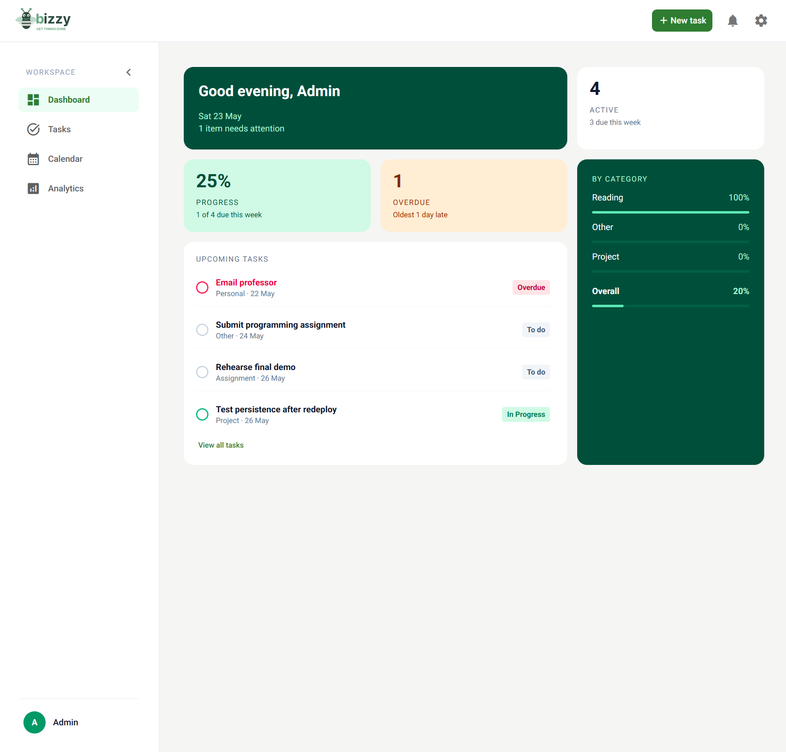
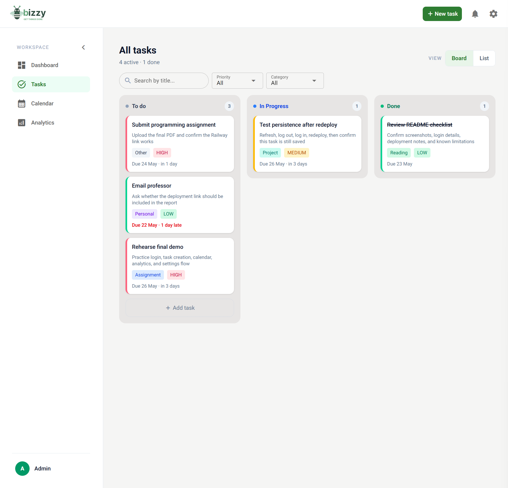
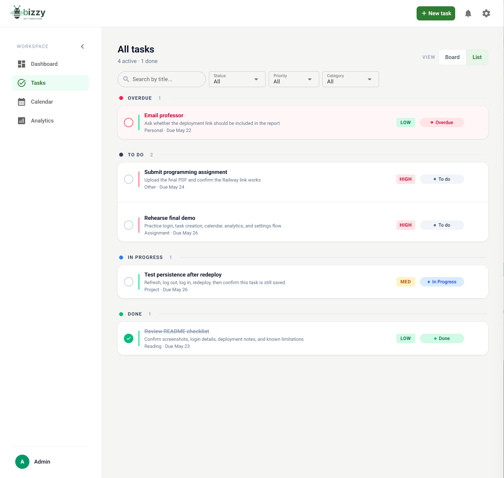
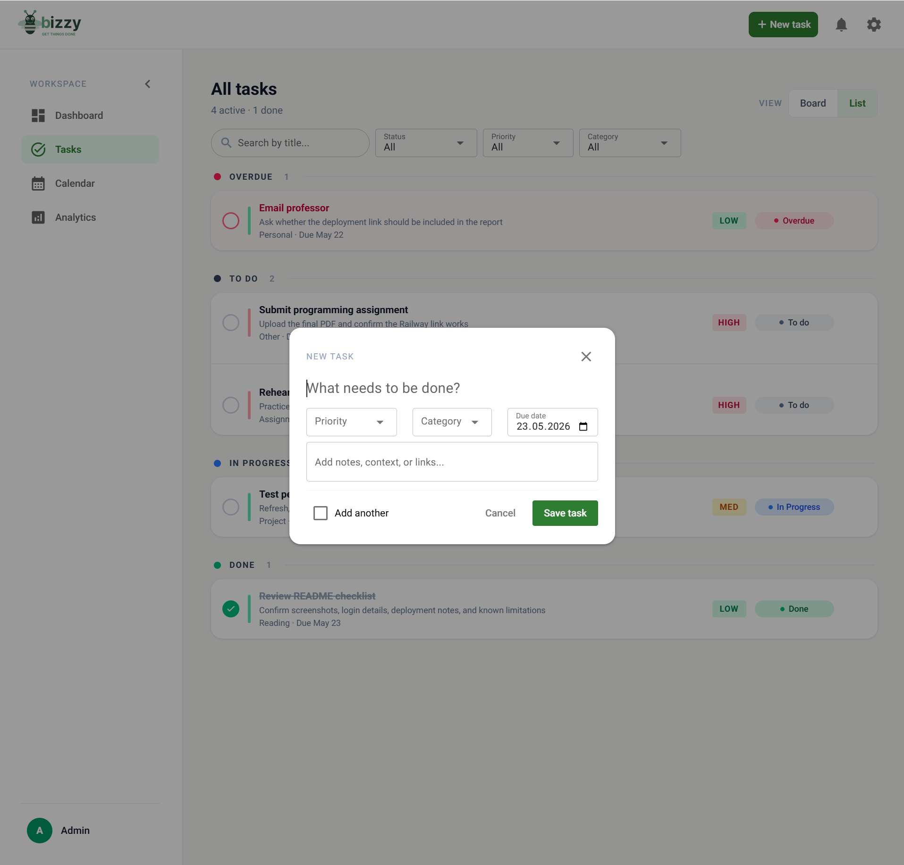
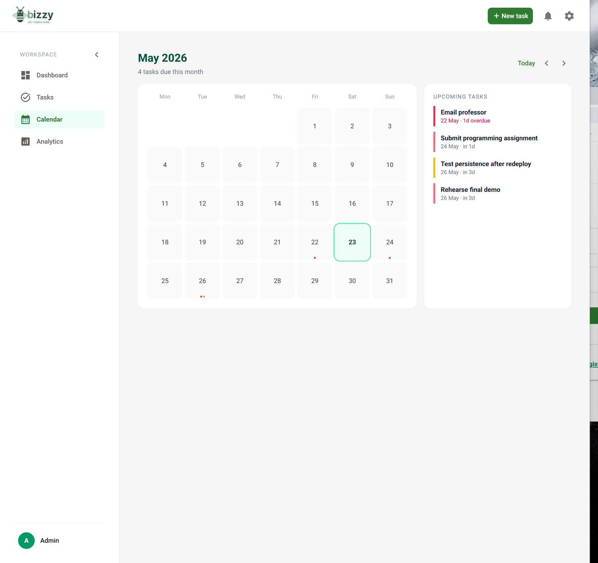
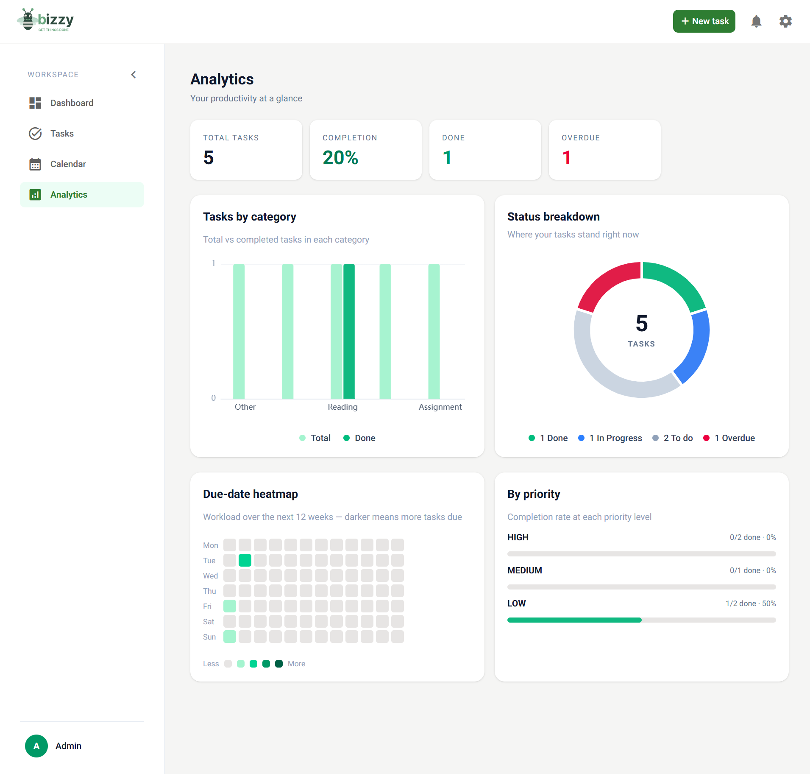
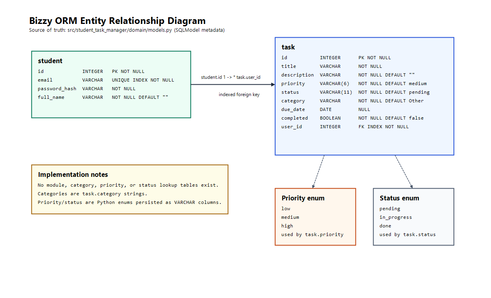

# Bizzy Student Task Manager

Bizzy is a browser-based student task manager for the Advanced Programming course.

It helps students keep academic work in one place: tasks, priorities, due dates, completion state, dashboard summaries, and a calendar view. The app uses NiceGUI for the browser UI, Python services for business logic, and SQLite persistence through SQLModel/SQLAlchemy.

## Problem

First-year students often manage assignments, exams, readings, and project work across several modules. Without a central task manager, deadlines are easy to miss and priorities are hard to compare.

Bizzy gives the student one place to track academic tasks, prioritize work, and review progress.

## Scenario

A student logs in to Bizzy in the browser. They create tasks with a title, optional description, priority, category, and due date. The app validates the input, stores the task in SQLite, and shows it in board, list, dashboard, and calendar views.

The student can update, complete, reopen, or delete their own tasks. Other users cannot access those tasks.

## User Stories

### 1. Create Task

As a student, I want to create a new task with details so that I can track my work.

Description: The user creates a task with title, description, priority, category, and due date.  
Inputs: title `str`, description `str`, priority `Priority`, category `str`, due_date `date | None`  
Outputs: task saved in database

---

### 2. View Tasks

As a student, I want to view my tasks so that I can see my workload.

Description: The application displays tasks belonging to the logged-in student.  
Inputs: authenticated user  
Outputs: list of tasks (`list[Task]`)

---

### 3. Mark Task as Complete

As a student, I want to mark tasks as complete so that I can track progress.

Description: The user updates a task's status to completed.  
Inputs: task_id `int`, authenticated user  
Outputs: updated task status

---

### 4. Delete Task

As a student, I want to delete tasks so that I can remove unnecessary items.

Description: The user deletes one of their own tasks from the system.  
Inputs: task_id `int`, authenticated user  
Outputs: task removed

---

### 5. Edit Task

As a student, I want to edit a task so that I can update its details.

Description: The user modifies task attributes.  
Inputs: task_id `int`, updated fields, authenticated user  
Outputs: updated task

---

### 6. Set Priority

As a student, I want to assign priority levels so that I can focus on important tasks.

Description: Tasks can be categorized as Low, Medium, or High priority.  
Inputs: priority (`low | medium | high`)  
Outputs: prioritized task

---

### 7. Add Due Date

As a student, I want to assign due dates so that I can manage deadlines.

Description: Each task can include a deadline.  
Inputs: due_date `date | None`  
Outputs: task with deadline

---
### 8. Filter Tasks

As a student, I want to filter tasks by status or priority so that I can focus on specific tasks.

Description: The user filters their task list based on criteria.  
Inputs: status, priority, category, search text
Outputs: filtered task list

---

### 9. Persistent Storage

As a student, I want my tasks saved permanently so that I do not lose my data.

Description: Tasks are stored in SQLite through SQLModel/SQLAlchemy.  
Inputs: task data  
Outputs: stored tasks

---

### 10. Input Validation

As a student, I want the app to validate my input so that I avoid errors.

Description: The service layer checks task input before persistence.  
Inputs: user input  
Outputs: validation messages or accepted input

---

### 11. Dashboard Overview

As a student, I want to see a summary of my tasks so that I can quickly understand my workload.

Description: The system displays task statistics and urgent task lists.  
Inputs: authenticated user tasks  
Outputs: task summary

---

### 12. Calendar View

As a student, I want to view tasks by date so that I can plan around deadlines.

Description: The system displays tasks in a monthly calendar view.  
Inputs: task due dates  
Outputs: calendar task overview

## Use Cases


**Main Use Cases**

- Create Task (Student)
- View Tasks (Student)
- Edit Task (Student)
- Delete Task (Student)
- Mark Task as Complete (Student)
- Filter Tasks (Student)

**Actors**

- Student (main user)

## Wireframes / Mockups

The original prototype and wireframes show the planned Bizzy interface. The final
implementation has been polished further, but the main flows remain the same:
dashboard overview, task board/list, calendar planning, analytics, and task
creation.

- [Original interactive Figma prototype](https://www.figma.com/design/iKEgafTYKCCSQv2dSyIWLF/Prototype?node-id=0-1&t=g92BfXm8z582fAA4-1)

### Dashboard Wireframe



### Task Board Wireframe



### Task List Wireframe



### New Task Wireframe



### Calendar Wireframe



### Analytics Wireframe



### Login Page


## Architecture


### Software Architecture

**Layers / components:**

- UI (NiceGUI browser interface)
- Application logic (task management and validation)
- Persistence (SQLite database with ORM)

**Design decisions:**

- Use MVC (Model-View-Controller) pattern
- Separate UI from business logic and database
- Store tasks in a database instead of JSON
- Keep task ownership scoped to the authenticated user; students cannot view or modify another user's tasks

The code uses Python's standard `src/` layout: the app package is `student_task_manager`, stored at `src/student_task_manager/`.

## Repository Structure

```text
application.py                         # NiceGUI launcher
src/student_task_manager/
  deployment.py                        # runtime env and deployment config helpers
  domain/
    models.py                          # SQLModel entities and enums
  services/
    auth_service.py                    # login/profile service logic
    task_service.py                    # task business rules
  data_access/
    db.py                              # lazy engine/session helpers and schema bootstrap
    dao.py                             # task persistence methods
  ui/
    controllers.py                     # UI boundary to services
    view_helpers.py                    # shared UI formatting and filter helpers
    app_shell.py                       # shared sidebar, header, and navigation shell
    dashboard_page.py                  # dashboard page renderer
    tasks_page.py                      # task board, list, filters, and view toggle
    task_dialog.py                     # task create/edit dialog
    calendar_page.py                   # calendar grid and selected-day sidebar
    analytics_page.py                  # analytics cards and charts
    settings_page.py                   # profile and account settings page
    notifications.py                   # notification menu and read-state helpers
    login.py
    registration.py
    routes.py                          # NiceGUI route setup and page wiring
tests/                                 # automated pytest suite
docs/
  architecture/                       # ERD source files and exported diagram
  wireframes/                          # selected prototype wireframe images
  TestCases.md                         # rubric test-case table
  Status.md
  Roadmap.md
  Changelog.md
prompts/                               # prompt workflow artifacts
```

## Database and ORM


The database models are defined in `src/student_task_manager/domain/models.py`.

**Entities:**

Student:
- id (`int`)
- email (`str`)
- password_hash (`str`)
- full_name (`str`)

Task:
- id (`int`)
- title (`str`)
- description (`str`)
- priority (`Priority`)
- status (`Status`)
- category (`str`)
- due_date (`date | None`)
- completed (`bool`)
- user_id (`int`, links the task to a student)

**Enums:**

Priority:
- low
- medium
- high

Status:
- pending (shown as To do)
- in_progress
- done

Tasks are linked to a student through `user_id`, so each logged-in student only works with their own tasks.
Inactive-user lifecycle management is outside the current project scope.

### Libraries Used

- NiceGUI for the browser interface
- SQLModel and SQLAlchemy for ORM and SQLite persistence
- passlib and bcrypt for password hashing
- pytest for automated tests
- Ruff for formatting and linting
- mypy for type checking

## Validation and Business Rules

Task validation and business rules are handled by `TaskService`:

- title is trimmed and must be at least 3 characters
- description is trimmed and may be empty
- priority is required
- category is trimmed and defaults to `Other`
- completing a task sets `status=done` and `completed=True`
- reopening a task moves it back to the user-facing `To do` state
- task reads and writes require an authenticated `user_id`
- accessing another user's task raises a task-not-found error

## Setup

Install the app and development tools:

```bash
python -m pip install -e ".[dev]"
```

## Run the App

```bash
python application.py
```

Local runs default to `http://127.0.0.1:8081` and store SQLite data in
`data/todo.db`. In deployment, the launcher reads Railway's `PORT` variable and
binds to `0.0.0.0`.

### Local Development Database

The project does not currently include a migration tool. During development,
schema-changing updates are applied by deleting and recreating the local SQLite
file at `data/todo.db`, then starting the app or running tests so SQLModel can
bootstrap the schema from `models.py`. Do not keep generated SQLite files in the
repository root.

To seed a development-only admin account in a local empty database, set:

```text
BIZZY_CREATE_DEV_ADMIN=1
BIZZY_DEV_ADMIN_PASSWORD=<local-dev-password>
```

Optional overrides are `BIZZY_DEV_ADMIN_EMAIL` and `BIZZY_DEV_ADMIN_NAME`.
The dev-admin flag is rejected when Railway environment variables are present.

## Railway Deployment

This repository includes `railway.json` with:

- builder: `NIXPACKS`
- start command: `python application.py`
- healthcheck path: `/`

`runtime.txt` pins the Railway/Nixpacks Python runtime to `python-3.11.9`,
matching the project's Python tooling target. Do not bump it to a local Python
version unless `pyproject.toml`, Ruff, mypy, and the deployment target are moved
to that version together.

Deploy from GitHub or with Railway CLI:

```bash
railway up
```

Set this service variable in Railway:

```text
STORAGE_SECRET=<long-random-secret>
```

Railway provides `PORT` automatically. Do not set it manually unless you are
debugging a port issue.

By default, local runs use `sqlite:///data/todo.db`. On Railway, the app detects
Railway environment variables and defaults to the persistent volume path
`sqlite:////app/data/todo.db`. For persistent SQLite storage on Railway, attach
a Volume at `/app/data`. You may also set `DATABASE_URL` explicitly:

```text
DATABASE_URL=sqlite:////app/data/todo.db
```

The app also corrects the known bad Railway value `sqlite:////data/todo.db` to
`sqlite:////app/data/todo.db`, because `/data` is not the mounted persistent
volume for this service.

If you do not attach a Volume, task data may be reset when Railway rebuilds or
restarts the service.

## Testing

The project includes the required test mix:

- 6 unit tests
- 3 database tests
- 3 integration tests

The documented test cases are in [docs/TestCases.md](docs/TestCases.md).

Run the test suite:

```bash
pytest tests/ --tb=short
```

Run all checks:

```bash
pytest tests/ --tb=short
ruff format --check src tests
ruff check src tests
python -m mypy src
```

## Documentation

- [docs/TestCases.md](docs/TestCases.md) - required test-case table
- [docs/Status.md](docs/Status.md) - current implementation status
- [docs/Roadmap.md](docs/Roadmap.md) - planned work sequence
- [docs/Changelog.md](docs/Changelog.md) - landed changes
- [AGENTS.md](AGENTS.md) - contributor and prompt workflow contract

## Team Contributions

| Team member | Contribution |
| --- | --- |
| Elpidio Dogbevi | SQLModel architecture, application logic and testing, project documentation, and presentation slides |
| Lencer Obonyo | Frontend/UI implementation, custom AI-agent prompts/workflows, automated tests, project documentation, and final deployment verification |

## Project Status

- [docs/Status.md](docs/Status.md)
- [docs/Roadmap.md](docs/Roadmap.md) - planned work and future scope
